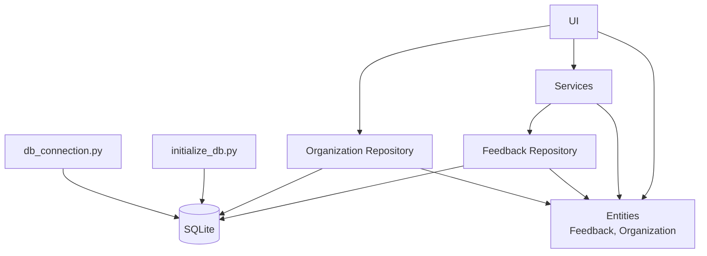
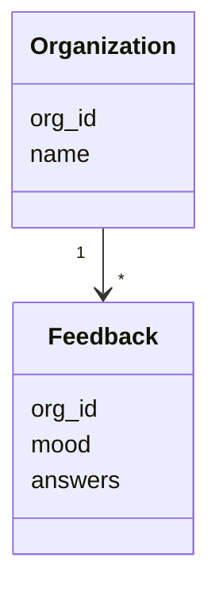
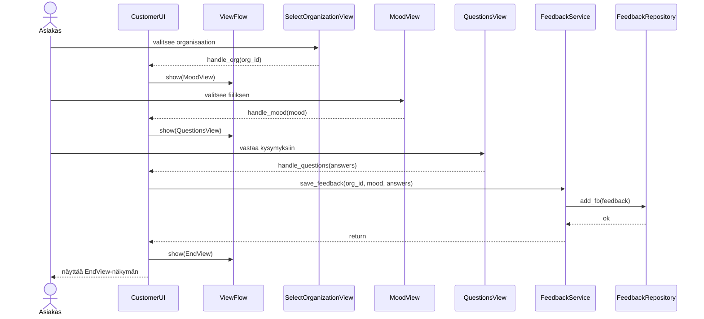
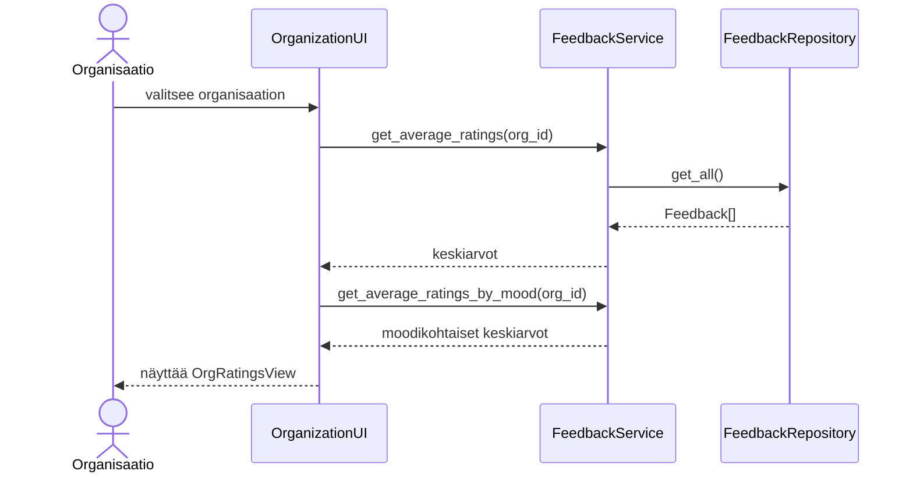

# Arkkitehtuurikuvaus

## Rakenne

Rakenne noudattaa kerrosarkkitehtuuria, jossa käyttöliittymä on eroteltu sovelluslogiikasta ja tietojen tallennuksesta.

### Pakkauskaavio

## Käyttöliittymä
Käyttöliittymää ohjaa UI-luokka, joka ensin näyttää käyttäjävalinnan, ja ohjaa käyttäjän sen jälkeen joko:

- Asiakaspolkuun (`CustomerUI`), tai
- Organisaatiopolkuun (`OrganizationUI`)

Asiakaspolku etenee seuraavasti:

1. Valitse organisaatio
2. Fiiliksen valinta
3. Kolmeen kysymykeen vastaaminen asteikolla 1-5
4. Lopetusnäkymä

Organisaatiopolussa käyttäjä valitsee organisaation, jolloin  näytetään koonti sen palautteista.

## Sovelluslogiikka

Sovelluslogiikasta vastaa `FeedbackService` joka tarjoaa eri metodeita: 

- `save_feedback(org_id, mood, answers)`
- `get_all()`
- `get_average_ratings(org_id)`
- `get_average_ratings_by_mood(org_id)`

FeedbackService tallentaa palautteen `Feedback`-oliona ja antaa tallennuksen vastuun `FeedbackRepository`-luokalle.
Service laskee myös organisaation palautteiden kysymyskohtaiset keskiarvot ja voi luokitella ne moodin mukaan.

`Organization`ja `Feedback` muodostavat sovelluksen tietomallin, jossa organisaatiolla on useita siihen liittyviä palautteita:

## Tietojen pysyväistallennus

Tietojen tallennuksesta huolehtii `repositories` luokat `FeedbackRepository` ja `OrganizationRepository`. Tiedot tallennetaan SQLIte- tietokantaan.

## Päätoiminnallisuudet

Kuvataan toimintalogiikkaa sekvenssikaaviona

### Asiakas antaa palautetta

Kun aloitusnäkymässä painetaan painiketta `Customer`, etenee sovellus seuraavasti:

### Organisaatio tarkastelee palautteita

Kun aloitusnäkymässä painetaan `Organization`, etenee sovellus seuraavasti:

