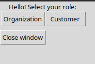
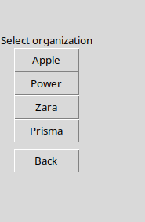
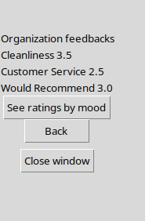
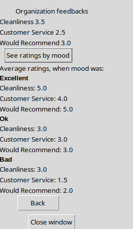
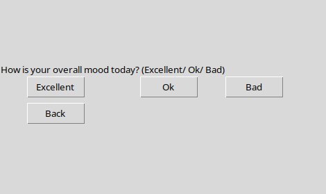
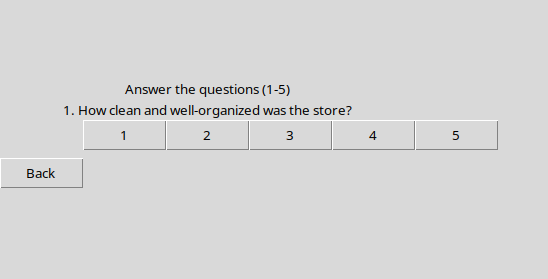
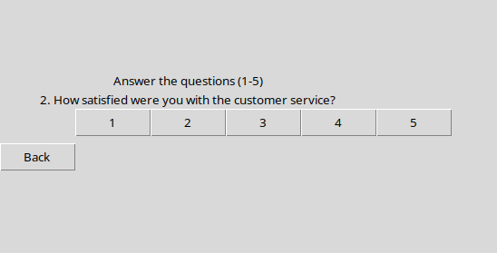
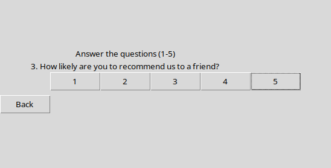

# Käyttöohje
Lataa viimeisimmän releasen lähdekoodi

## Käynnistäminen

Ennen käynnistystä, asenna riippuvuudet komennolla:

```bash
poetry install
```

ja suorita sen jälkeen alustustoimenpiteet komennolla:

```bash
poetry run invoke build
```

Käynnistä ohjelma komennolla:

```bash
poetry run invoke start
```

## Käyttäjän valinta

Sovellus käynnistyy käyttäjän valinta ikkunaan:



Valitse nappia painamalla, haluatko jättää palautteen vai tarkastella organisaation työntekijänä oman organisaation palautteita.

## Organisaatio rooli

Valittuasi käyttäjäksi organisaation, aukeaa tietyn organisaation valintaikkuna. Painiketta painamalla voi valita, minkä organisaation palautteita haluat tarkastella:




### Palautteiden tarkastelu
Valittuasi organisaation, näet sille annettujen palautteiden tiivistelmän. Voit myös tarkastella palautteita ryhmiteltynä moodin mukaan:



ja 




## Asiakas rooli
Valittuasi käyttäjäksi asiakkaan, aukeaa tietyn organisaation valintaikkuna. Painiketta painamalla voi valita, mille organisaatiolle haluaa antaa palautetta:


### Fiilikseen vastaaminen
Valittuasi organisaation, sovellus kysyy sinulta ensin, millainen fiilis sinulla ylipäätään on tänään. Klikkaamalla sinulle parasta vaihtoehtoa pääsee eteenpäin:



### Kysymyksiin vastaaminen
Valittuasi fiiliksen, sovellus kysyy sinulta kolme (3) kysymystä liittyen asiointiin yrityksessä. Vastaa kysymyksiin asteikolla 1-5:







### Kiitos näkymä
Vastattuasi kaikkiin kysymyksiin voit sulkea ikkunan:


**Huom!** Voit painaa `Back` -nappia päästäksesi edelliseen ikkunaan tai `Close Window` sulkeaksesi ikkunan, jos sellaine nappi on näkymässä tarjolla.

