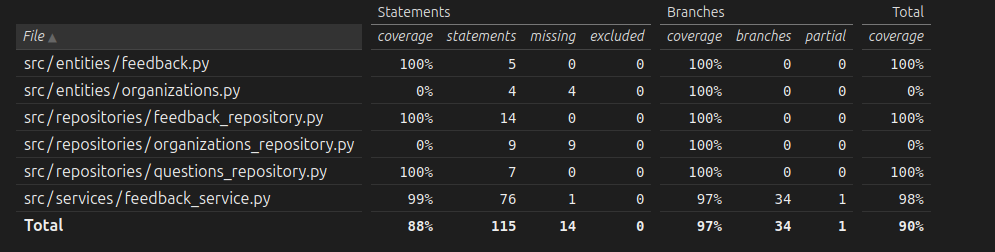

### Testidokumentti
Sovellukselle on luotu automatisoituja yksikkö- sekä integraatiotestejä. Sovellusta on testattu myös manuaalisesti.

## Yksikkö- ja integraatiotestaus
### Sovelluslogiikka 
Sovelluslogiikasta vastaava luokka `FeedbackService` testataan `TestFeedbackService` -luokassa. Testeissä FeedbackService -olio saa riippuvuuksiksi valekomponentit (FakeRepoForTest ja FakeQuestionRepoForTest), jotka korvaavat tietokannan ja mahdollistavat testauksen ilman pysyvää tallennusta. 

### Repositorio-luokat
`FeedbackRepository` ja `QuestionsRepository` luokkia testataan omilla testiluokilla. Testeissä käytetään SQLite:n in-memory -tietokantaa, joka alustetaan test_db.py-moduulissa, jolloin testit suoritetaan eristyksessä ilman päätietokantaa.
`FeedbackRepository` -testit varmistavat palautteen tallennuksen ja haun toimivuuden. `Questionsrepository` -testit varmistavat oikeanlaisen kysymysten tallennuksen ja palauttamisen.

### Testauskattavuus
Käyttöliittymäkerros poislukien testihaaraumakattavuus on 90%

Jätin index.py, initialize.py ja db_connection.py testikattavuuden ulkopuolelle. Testaamatta jäi organizations_repository ja organizations.py niiden vähäisen käytön vuoksi.

### Järjestelmätestaus
Sovelluksen järjestelmätestaus on suoritettu manuaalisesti.

### Asennus ja konfigurointi

Sovellus on haettu ja sitä on testattu käyttöohjeen kuvaamalla tavalla Linux-ympäristössä.

### Toiminnallisuudet
Kaikki toiminnallisuudet, joita käyttöohje ja määrittelydokumentti listaa, on käyty läpi. 

## Sovellukseen jääneet laatuongelmat
UI:n koodissa on jonkin verran toistuvuutta, mikä hankaloittaa ylläpitoa. Mood-arvot on kiinteinä merkkijonoina koodissa, mikä hankaloittaa laajentamista. Sovelluslogiikka on suhteellisen yksinkertainen.

