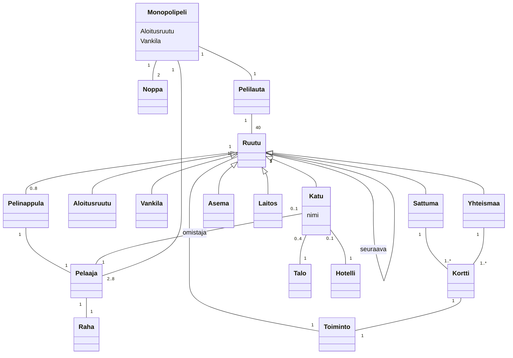

```mermaid
 classDiagram
    Monopolipeli "1" -- "2" Noppa
    Monopolipeli "1" -- "1" Pelilauta
    Monopolipeli : Aloitusruutu
    Monopolipeli : Vankila
    Pelilauta "1" -- "40" Ruutu
    Ruutu "1" -- "1" Ruutu : seuraava
    Ruutu "1" -- "0..8" Pelinappula
    Pelinappula "1" -- "1" Pelaaja
    Pelaaja "2..8" -- "1" Monopolipeli

    Ruutu <|-- Aloitusruutu
    Ruutu <|-- Vankila
    Ruutu <|-- Sattuma
    Ruutu <|-- Yhteismaa
    Ruutu <|-- Asema
    Ruutu <|-- Laitos
    Ruutu <|-- Katu
    
    Ruutu "1" -- "1" Toiminto
    Sattuma "1" -- "1..*" Kortti
    Yhteismaa "1" -- "1..*" Kortti
    Kortti "1" -- "1" Toiminto  

    Katu : nimi
    Katu "0..4" -- "1" Talo
    Katu "0..1" -- "1" Hotelli
    Pelaaja "1" -- "1" Raha
    Katu "0..1" -- "1" Pelaaja : omistaja
```
